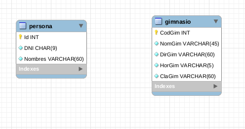

# Crud Socios Ismael Gym

Crud para la administración manual de los socios del gimnasio ficticio Ismael Gym's como complemento de la web de Lenguaje De Marcas.

## Partes del CRUD
Al entrar a la web se abrirá el index.jsp, el cual contiene un apartado para hacer login mediante usuario y contraseña.

Dentro de esta lista tendremos varias opciones.

Primero de todo podremos observar una lista de todos los socios que se encuentran actualmente registrados en la base de datos, de ellos nos aparecerá su ID, DNI, nombre completo y un apartado de acciones para editar o eliminar al socio.

Arriba de esta lista podremos ver dos botones, uno azul para volver al index y otro verde para agregar un nuevo socio. En el caso de querer agregar un nuevo socio nos llevará a la siguiente ventana.

En ella tendremos tres apartados, para rellenar el DNI, el nombre completo y el gimnasio preferido (lista desplegable alimentada de la tabla gimnasio de la BD) del socio.

En el caso de querer editar un socio existente podremos hacerlo pulsando el boton amarillo en el apartado acciones del socio, lo que nos llevará a la siguiente página.

En ella nos aparecerá para editar el DNI y el nombre completo del socio (mostrando los datos que tiene actualmente), simplemente se pueden cambiar por los que se deseen y los cambios se verán reflejados en la BD.

## Base de Datos
La base de datos es bastante sencilla y solo cuenta con dos tablas (no relacionadas entre sí*).

