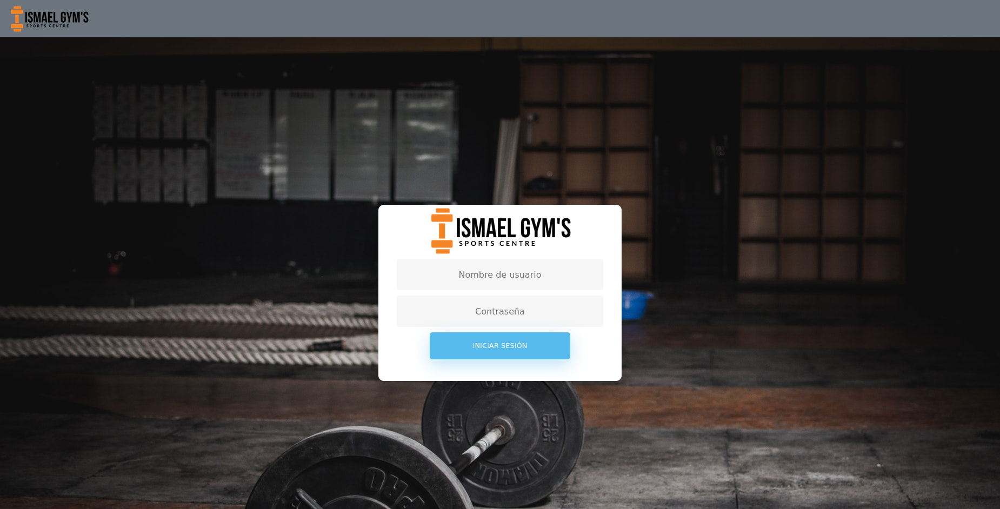
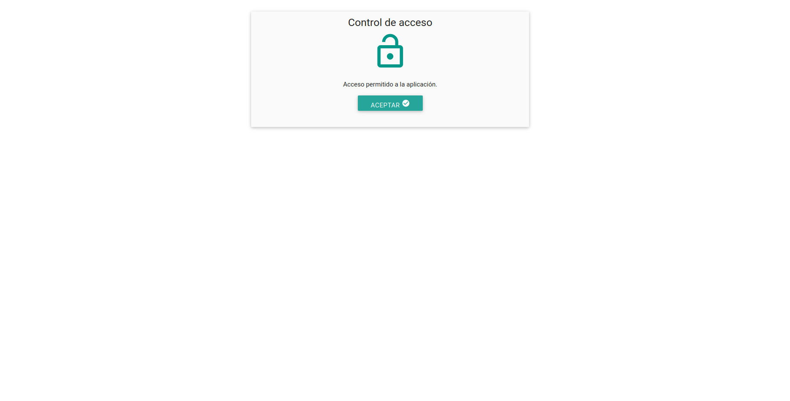
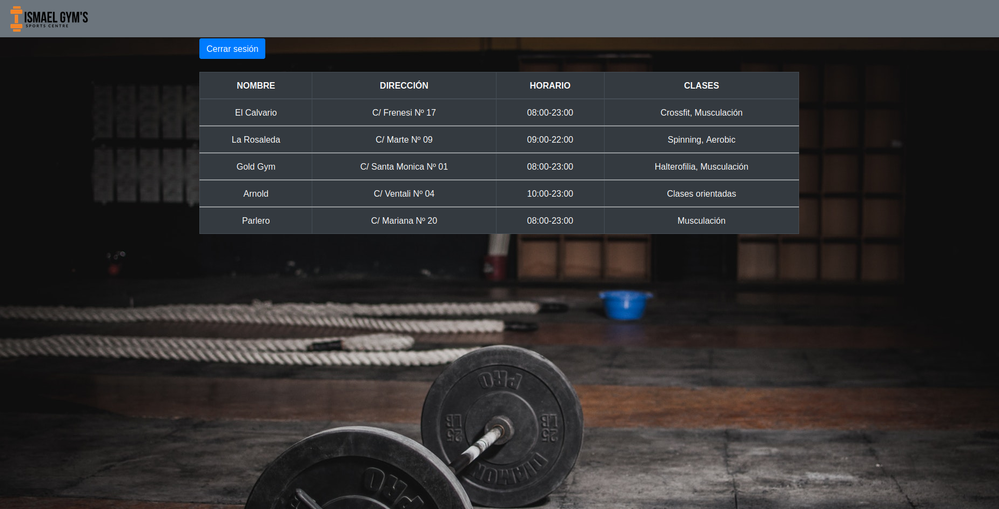
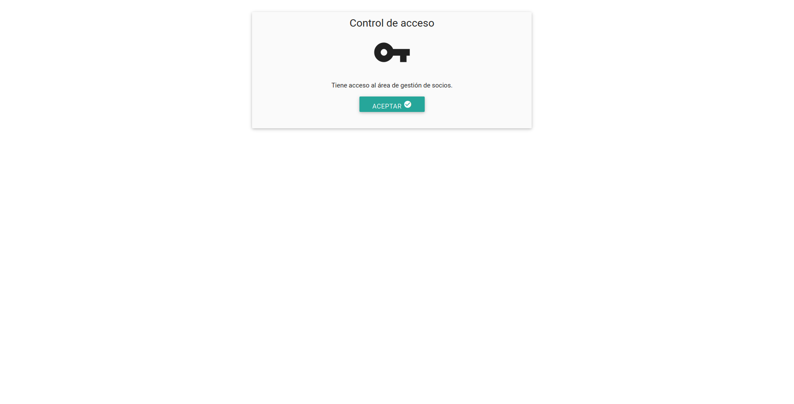
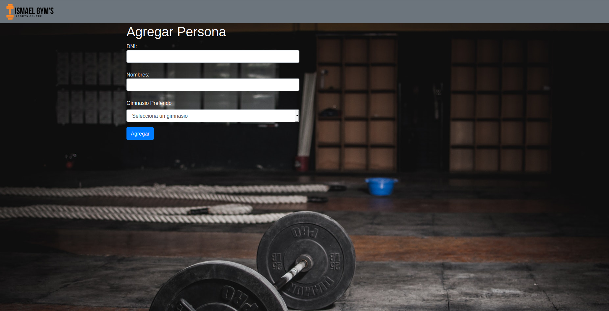
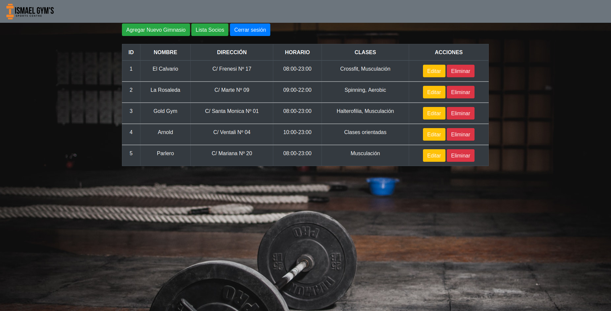
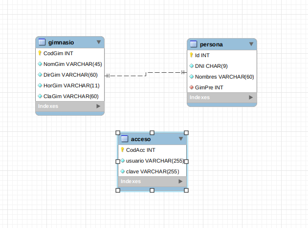

# Crud Socios Ismael Gym

Crud para la administración manual de los socios del gimnasio ficticio Ismael Gym's como complemento de la web de Lenguaje De Marcas.

[Video explicativo](https://youtu.be/De8pKZWp8lI)

## Partes del CRUD
Al entrar a la web se abrirá el index.jsp, el cual contiene un apartado para hacer login mediante usuario y contraseña.

El crud tiene dos usuarios disponibles, un admin y un usuario normal.
Para acceder al admin: Usuario = admin ; Contraseña = 123456
Para acceder al usuario normal: Usuario = ismael ; Contraseña = ismael13

> Acceso No Admin

En el caso de que iniciemos sesión con el usuario normal "ismael" nos aparecerá la siguiente confirmación.

Tras pulsar en aceptar nos llevará a la vista para no admins de la aplicación.

Dentro de esta vista podremos ver una lista de todos los gimnasios disponibles de la cadena de gimnasios ficticia "Ismael Gym's" y también dispondremos de un botón para cerrar sesión en la parte superior.

> Acceso Admin

En caso de que iniciemos sesión con el usuario admin "admin" nos aparecerá la siguiente confirmación.

Tras pulsar en aceptar nos llevará a la vista para admins de la aplicación.

Dentro de esta vista podremos ver una lista de todos los socios de la cadena de gimnasios "Ismael Gym's". Dentro de la tabla tendremos el ID, DNI, nombre y gimnasio preferido de cada persona además de un apartado de acciones que permiten editar o eliminar a cada persona.

En la parte superior encontraremos tres botones para agregar una persona nueva, ir a la lista de gimnasios de admin y cerrar sesión respectivamente.

En caso de querer agregar una persona nueva nos llevará a la siguiente vista.

En ella tendremos tres apartados para introducir el DNI, nombre completo y gimnasio preferido (lista alimentada de la base de datos gimnasio) de la persona.

En el caso de querer editar la persona podremos hacerlo mediante el botón amarillo de la lista de socios. Pulsandolo nos llevará a la siguiente vista.

Donde encontraremos exactamente los mismos campos que en agregar persona (con los datos ya existentes) para poder actualizar al socio correctamente.

Desde la lista de socios también podremos eliminar a cualquier persona mediante el botón rojo en acciones.

Además, pulsando el botón de lista gimnasios nos llevará a una nueva vista en la que podremos realizar exactamente las mismas acciones para la tabla gimnasio que con los socios.

Agregado de gimnasios

Modificado de gimnasios

Y mediante el botón rojo se eliminará el gimnasio elegido.

Por supuesto todos estos cambios serán visibles para los usuarios normales que entren desde la vista no admin.

## Base de Datos
La base de datos es bastante sencilla y solo cuenta con tres tablas:

Gimnasio con CodGim (código identificativo único para cada gimnasio), NomGim (nombre del gimnasio), DirGim (dirección del gimnasio), HorGim (horario del gimnasio) y ClaGim (clases disponibles en el gimnasio).

Persona con Id (código identificativo único para cada persona), DNI (DNI de la persona), Nombres (nombre y apellidos completos de la persona) y GimPre (foreign key de gimnasio que determina el gimnasio preferido de la persona).

Acceso con CodAcc (código identificativo único para cada cuenta), usuario (nombre de usuario para acceder) y contraseña (contraseña para acceder).

En la imagen se puede observar que las únicas tablas relacionadas son gimnasio con persona, en este caso para poder determinar el gimnasio preferido de cada persona.

> :star: Si te ha gustado este proyecto, dale una estrellita al [repositorio](https://github.com/ismaelpacheco13/Crud-Ismael-Gym).
